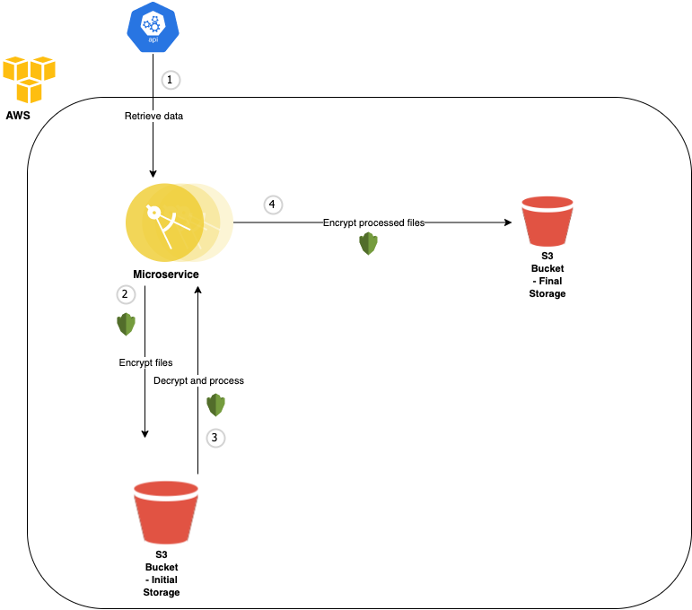
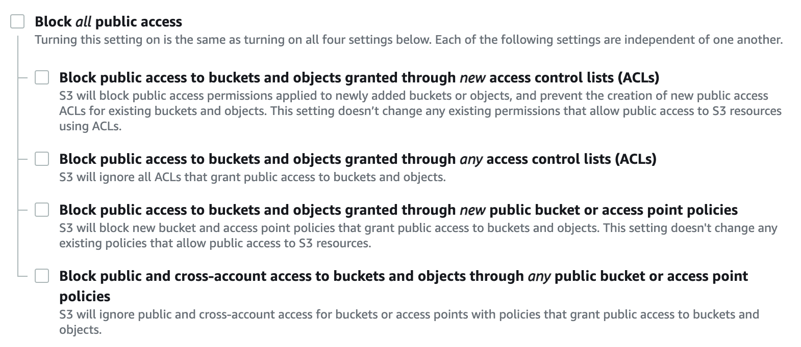
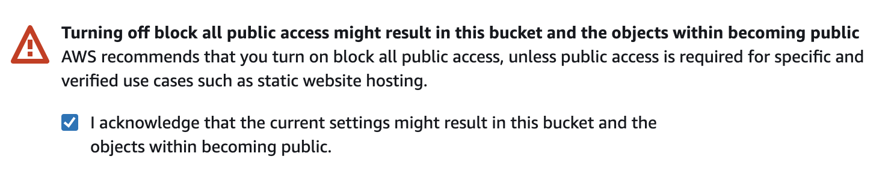

# Microservice Technical Assignment

# Intro and Solution

This solution uses Terraform and provisions the cloud resources in AWS for the microservice. 

I have decided to use S3 for both data storages. S3 buckets allow secure and scalable storage of static files, as well as having an easily configurable encryption functionality.

## Architecture



# The Infrastructure

There are three main resources that are provisioned by this repository. 

- iam
- kms
- s3

## IAM

This module provisions an IAM role. This role gives the microservice permissions to access the Amazon S3 buckets where the files are stored, and access to the kms key for encryption/decryption. It also provsions and outputs an EC2 instance profile that is attached to this role. This instance profile can then be attached to the microservice cloud server.

## KMS

This module provisions a Amazon kms (Key Management Service) key which is used to encrypt and decrypt the files from S3.

## S3

This module provisions the two S3 buckets used to store the files. One bucket is for the initial storage once the data has been retrieved from the API, and the other is to store the files after they have been decrypted and processed.

I have enabled server side encryption by default on both buckets, meaning any objects uploaded to the buckets will be automatically encrypted using the key provisioned in the `kms` module, and decrypted when retrieved.

A bucket policy is attached that denies all access to the S3 buckets, unless the request has come from a specific IP address. This adds an extra layer of security to the storage.

As the microservice is not included in this configuration, the default IP address is open to the world (`0.0.0.0/0`). However this should be changed to the production IP address of the microservice.

# Prerequisites

There is some configuration that needs to be done before running the Terraform.

1. An AWS account with permissions for your Terraform node/server

You will need an AWS account, and the user/role that will be running the Terraform script will need the following IAM permissions:

- S3 Access
- KMS Access
- IAM Access

The server running the Terraform will also need Terraform installed. You can find out how to install Terraform [here](https://learn.hashicorp.com/tutorials/terraform/install-cli).

2. Create a state bucket in the AWS console

You will need to create a bucket that will hold the Terraform state files. State files are a JSON representation of all your cloud resources.

- Navigate to the AWS console and select **Services > S3**
- Click **Create bucket**
- Name the bucket **microservice-state-bucket**. If you choose a different name, make sure you change the bucket attribute in the `terraform.tf` file to match the name of your state bucket.
- Specify your chosen region
- Uncheck the **Block all public access** box 
- Check the box that acknowledges the objects are public 
- Click **Create bucket**

3. Terraform version

Terraform 12 or higher is required because the majority of the code in this repository does not use interpolation syntax.

4. AWS Region

The default value for the `region` variable in `variables.tf`, and the `region` attribute in `terraform.tf`, is **eu-west-1**. You may want to change this depending on the location of where you run this script.

# Applying & Destroying the resources

The script that provisions the infrastructure is `scripts/apply_terraform.sh`.

Execute the following in a shell to initiate the Terraform deployment:

```
bash scripts/apply_terraform.sh
``` 

To destroy the infrastructure, run the `scripts/destroy_terraform.sh`:

```
bash scripts/destroy_terraform.sh
```

# Accessing the deployed resources

As explained earlier, I have provisioned an IAM role to be attached to the microservice cloud virtual instance, so it will have the necessary permissions to access the kms key and the S3 buckets. The resources can be accessed through the module outputs.

The requirements mention that the microservice is running in a cloud virtual instance. With this in mind, I can attach the IAM role to a microservice EC2 instance through the `iam_instance_profile` attribute of the `aws_instance` resource. For example:

```
resource "aws_instance" "microservice" {
  iam_instance_profile = module.iam.instance_profile
  ...
}
```

If the other resources (S3 & kms) need to be accessed within the Terraform configuration, we can do this through the module outputs, like so:

```
module.s3_initial.s3_bucket_arn
module.s3_final.s3_bucket_arn
module.kms.aws_kms_key_arn
```

For example we may want to pass the module outputs as variables to our cloud server through the use of a user data script. The user data script is executed on the cloud server when it is initialised, and the variables you pass through can be accessed on the machine:

```
data "template_file" "init" {
  template = file("scripts/user-data-script.sh.tpl")

  vars = {
    s3_initial      = "${module.s3_initial.s3_bucket_arn}"
    s3_final        = "${module.s3_final.s3_bucket_arn}"
    aws_kms_key_arn = "${module.kms.aws_kms_key_arn}"
  }
}
```

Which can then be rendered on the cloud server like so:

```
resource "aws_instance" "microservice" {
  user_data = data.template_file.init.rendered
}
```

The `user-data-script.sh.tpl` does not exist in this repository and is just an example of a script that *could* be executed on the microservice cloud server, with access to the necessary variables.

The microservice may be using the AWS CLI or SDK and could interact with the resources in this way.

Below is an example of how a processing script, running on the microservice, could upload/retrieve the files from Amazon S3.

## Upload

```
#!/bin/bash

aws s3 cp <file> s3://<bucket_name>
```

## Download

```
#!/bin/bash

aws s3 cp s3://<bucket_name>/<file> ./
```

We do not need to specify a kms key id in the cli command because server side encryption is enabled by default on the S3 buckets in the Terraform configuration. This means objects are automatically encrypted before saving it to disk, and decrypted when they are downloaded.

# Conclusion

Thank you for reading through. I hope you have your cloud resources up and running!